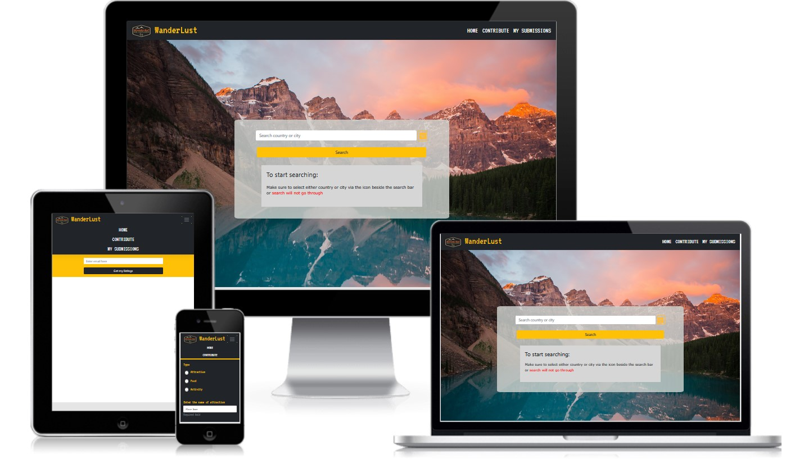

# WanderLust

Access live demo site [here](https://the-wanderlust-experience.netlify.app/)

## Background

There are many travel blogs created by avid travellers detailing their experiences when they go to certain places. However, these blogs may only be chanced upon by people who makes more detailed searches when they are loking for more information on a particular place. These travel destinations are often not well recorded, not gathered in databases locally and require people to trawl and search from various websites to piece different information on them which takes time. This is the reason why planning for a holiday overseas requires alot of research time to plan out an itinerary.

## Project Overview

For people looking to travel, their main methods to plan an itinerary is to source online and look draw ideas from the experiences of other travellers who have been to those locations. They would look primarily at the costs involved such as entrance fee to an attraction or price they have to pay to engage in an activity. Another concern is how highly rated is the attraction in terms of enjoyment as experienced by other travellers. If they haven't been to a certain city in a country, they would most likely plan their itinerary by sourcing from others' experiences. It would be better if there is a platform that allows people to share their experiences in a country/city.

---

## The Five Planes of UI/UX

### Strategy

#### Organization's Goals
As someone who likes to travel, I always find myself spending a lot of time researching places of interests in cities and countries that I am visiting by asking people and visiting various sites online. To be able to facilitate such exchange of information between avid travellers, a one-stop centralised platform for each individual to share their experiences will help greatly with itinerary planning.

#### Users' Goals
 Usually, people around the age of 23 to 33 where they have the financial capabilities and lesser life commitments (E.g., family kids etc) to allow them to have time and money to travel. They most often prefer to travel by themselves or with friends. This means that they often have to plan the trips themselves. 
 This platform will allow them to get the help they need in terms of planning of itinerary by allowing them to source the website to look for some ideas for their travel plans or to share their experiences during their travels in a particular country/city so that other users can benefit from it.

1. **Organisation**
   - Objective: To have a centralized space to contribute and search for topics around travel locations

2. **Users: Travellers**
   - Objective: To be able to research quickly to find more information about a particular travel destination from other users that have been to the location 

   - Needs:
      - To search about attractions, food and activities that other users have experienced in a target country or city
      - To be able to contribute after their travels
   
   - Demographics and Characteristics:
       - Young to working adults
       - Enthusiastic about travelling
       - Very used to browsing internet
   
   - Pain point:
       - Need to find out what is attractive about the certain location.
       - Need to find out what cannot be missed when touring a certain city or country
       - Need to learn about these experiences first from people that were in their positions and went ahead to explore

User Stories | Acceptance Criteria(s)
------------ | -------------
As a potential tourist to the target city/country, I am interested to know what attractions/food/activities that the location has to offer that is deemed a good experience by other travellers | Articles should be able to show all the places visited by other users and see how well they are rated by these users along with the price they spend at the attarction/food/activity
As a potential tourist that wishes to stick to a budget but also experience a good time in a particular location | Users must be able to search for articles that shows attractions that are free
As a potential tourist, I want to visit locations that are highly-rated(4-5 stars) | Articles should be searchable by the best-rated ones
As a potential tourist, I may have certain preferences when it comes to looking for attractions, I could prefer places that have scenery or activities to do | Articles should be searchable by what they are best known for, for example, searching for attractions with scenery may return articles that involves places with scenic views as part of their attraction.

### Scope

### Database

A backend server will thus be necessary in order to allow communication between the site and MongoDB. As such an Express server have been set up and deployed to [Heroku](https://www.heroku.com/). API endpoints are accessible via the base at https://tgc-wanderlust.herokuapp.com/.

#### Content
Content will be crowd sourced from public, thus presentation of data contributed to the site is essential. A landing page is also included for branding purposes and allows site visitors to have a quick glance and understanding of the site.

#### Functional
- Search function of all articles posted on its Country, City, Categories and/or Sub-categories
- Create new article function
- Edit and Delete function on each article 
- In order to exert control, registration/verification on email is included for actions performed on articles and collections

#### Non-functional
- Mobile responsiveness: Forms and search results display should not obstruct users' experience in the site
- Accessibility: Colors used will not make it hard for users to make out the features of the app
- Performance: Database may get larger and slower to load overtime, a loading screen is included to help bridge the gap between site and data loading

### Structure

Note: 
Added a submission branch where users can verify their identity using his/her own email to access a list of articles he/she posted to do editing or deleting

### Skeleton
Initial prototyping is seen here 

The prototype is done with a mobile first approach and throughout the project it have been re-visited several times while working on the project and styling across devices. 

<!-- #### Color Scheme

<figure>
    
</figure>

- As green and gold are often associated with Islam, they have been chosen specifically for the site
- The rest of the colors are then randomly generated via [Coolors](https://coolors.co/)
- Brighter colors are chosen to be used emphasized content
- Darker colors are chosen to be used for text, shadows and for overlaying images
- Lighter colors are chosen to be used as background colors, and to be used as contrast text colors

#### Font
_Reem Kufi_ have been chosen as the font for headings, titles, subtitles, etc, because it was designed with the Arabic calligraphy in mind and then combined with Latin component later on. With the Arabic calligraphy system as its backbone, the font will breed familiarity with its intended users.

_Raleway_ is used for all body text meant for reading, to server as a contrast to the former font with its thinner weight and lining.

---

## Testing
Test Cases can be found [here](/readme/test_cases.xlsx)

--- -->

## Dependencies and Sources

### Backend
1. [Express](https://expressjs.com/) as the framework for routing to project's endpoints 
2. [MongoDB Node Driver](https://www.mongodb.com/docs/drivers/node/current/) for accessing database on MongoDB using their API
3. [cors](https://www.npmjs.com/package/cors) as middleware to enable CORS
4. [dotenv](https://www.npmjs.com/package/dotenv) to separate code from envrionment variables
5. [Yup](https://github.com/jquense/yup) is used for validation of forms in the backend

### Frontend
1. [React](https://reactjs.org/) as the frontend framework
2. [Axios](https://axios-http.com/) as HTTP client to Express server endpoints
3. [React-Bootstrap](https://react-bootstrap.github.io/) is used to do most of the styling of the website including forms
4. [Yup](https://github.com/jquense/yup) is used for validation of forms 

### Platforms and Software
1. [Git](https://git-scm.com/) for version control
2. [GitHub](http://github.com) for the repository
3. [Heroku](https://www.heroku.com/) for deployment of Express server
4. [Netlify](https://www.netlify.com/) for deployment of React app

### Logos and Images
1. Logo used is designed using canva [Canva](https://www.canva.com/q/pro/)
2. Landing page background photo is by [Garrett Parker](https://unsplash.com/@garrettpsystems) downloaded from [Unsplash](https://unsplash.com)

   
### Other Attributions
1. [Paul Chor](https://github.com/kunxin-chor) for all his guidance and using his tutorials as references for the codes 
2. [Keeguon](https://gist.github.com/keeguon/2310008) for the data used in MongoDB's Countries collection

---

## Deployment

### Build
Backend is build using Node.js and Express. Frontend have been created with create-react-app which includes a webpack that builds the files for production environment.

### Backend Deployment
Express server is deployed using [Heroku](https://www.heroku.com/).

Prerequisites:
- Heroku is connected and authorized to Github account under "Deploy"
- Correct repository is selected under "App connected to Github"
- Automatic deploys have been enabled for continuous deployment

Steps to publish:
1. After connecting to repository, ensure edits were added, commited, and pushed to Github repository
2. Heroku will perform automatic deployments upon detecting changes

### Frontend Deployment

The React app is hosted using [Netlify](https://www.netlify.com/).

Prerequisites:
- Any edits were added, commited, and pushed to Github repository
- Netlify is connected and authorized to Github account
- Netlify is connected to GitHub repository via "New site from Git"
- "GitHub"  has been selected for continuous deployment

Steps to publish:
1. After connecting to repository, ensure edits were added, commited, and pushed to Github repository
2. Netlify will start to build and perform automatic deployments upon detecting changes

---
